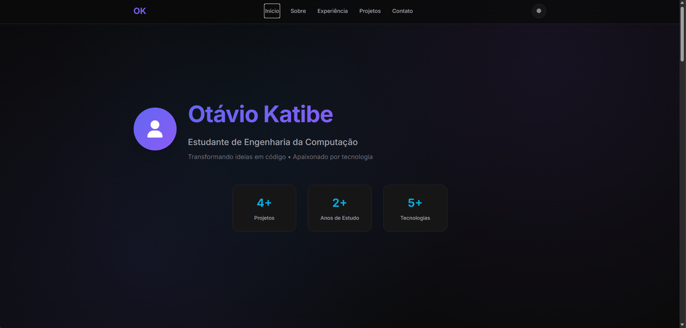

# Portfólio Pessoal - Otávio Katibe

Este é o repositório do meu portfólio pessoal, uma página web de única página (Single Page Application) projetada para mostrar minhas habilidades, projetos e experiência como estudante de Engenharia da Computação.



## ✨ Funcionalidades

*   **Design Moderno e Responsivo**: Interface limpa e adaptável a diferentes tamanhos de tela, de desktops a dispositivos móveis.
*   **Tema Claro/Escuro**: Alternância de tema com persistência no `localStorage` para manter a preferência do usuário.
*   **Carregamento Dinâmico de Projetos**: Os projetos são carregados a partir de um objeto JavaScript, facilitando a adição e atualização.
*   **Filtro de Projetos**: Filtre os projetos por categoria (Web, Java, Fullstack, etc.).
*   **Animações e Efeitos**: Animações sutis de scroll (Scroll Reveal) e efeitos de hover para uma experiência de usuário mais agradável.
*   **Formulário de Contato Funcional**: Formulário com validação em tempo real no lado do cliente.
*   **Navegação Suave**: Scroll suave para as seções da página.
*   **Código Organizado**: JavaScript modularizado para gerenciar diferentes aspectos da aplicação (projetos, navegação, tema, etc.).

## 🚀 Tecnologias Utilizadas

*   **Frontend**:
    *   HTML5
    *   CSS3 (com Variáveis CSS para fácil customização de temas)
    *   JavaScript (ES6+)
*   **Ícones**:
    *   [Font Awesome](https://fontawesome.com/)
*   **Fontes**:
    *   [Google Fonts](https://fonts.google.com/) (Inter e JetBrains Mono)

## 📂 Estrutura do Projeto

```
/
├── index.html          # Estrutura principal da página
├── styles.css          # Estilização completa do site
├── script.js           # Lógica da aplicação, dados dos projetos e interatividade
├── images/             # Pasta para imagens dos projetos e screenshots
└── README.md           # Este arquivo
```

## 🛠️ Como Executar Localmente

1.  Clone este repositório:
    ```bash
    git clone https://github.com/otvkatibe/Portfolio_otv.git
    ```
2.  Navegue até o diretório do projeto:
    ```bash
    cd Portfolio_otv
    ```
3.  Abra o arquivo `index.html` no seu navegador de preferência.

## 🔧 Como Customizar

*   **Informações Pessoais**: Edite diretamente o conteúdo no arquivo `index.html` nas seções `Sobre`, `Experiência`, etc.
*   **Projetos**: Para adicionar, remover ou editar projetos, modifique o array `portfolioData.projects` no arquivo `script.js`.
*   **Links Sociais**: Atualize o array `portfolioData.socialLinks` em `script.js`.
*   **Estilos e Cores**: As cores principais, fontes e espaçamentos podem ser facilmente alterados modificando as variáveis CSS na seção `:root` do arquivo `styles.css`.

## ✉️ Contato

*   **Email**: otavio.katibe@aln.senaicimatec.edu.br
*   **GitHub**: [otvkatibe](https://github.com/otvkatibe)
*   **Instagram**: [@katibeotavio](https://www.instagram.com/katibeotavio)